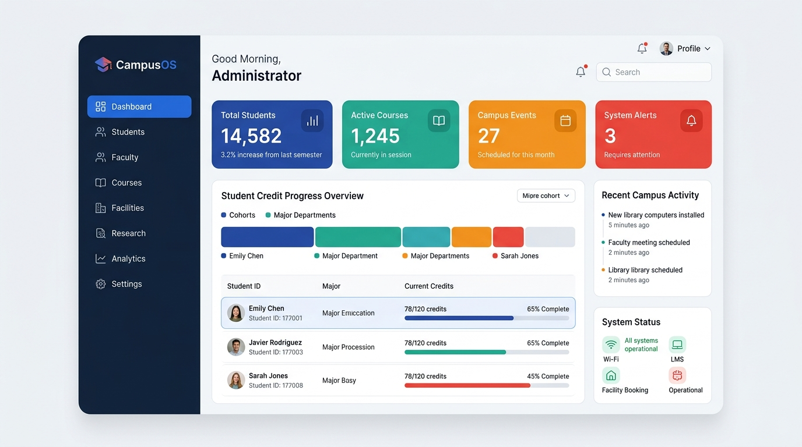
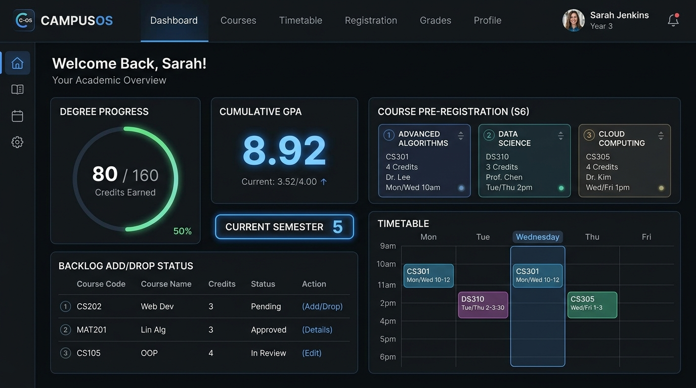
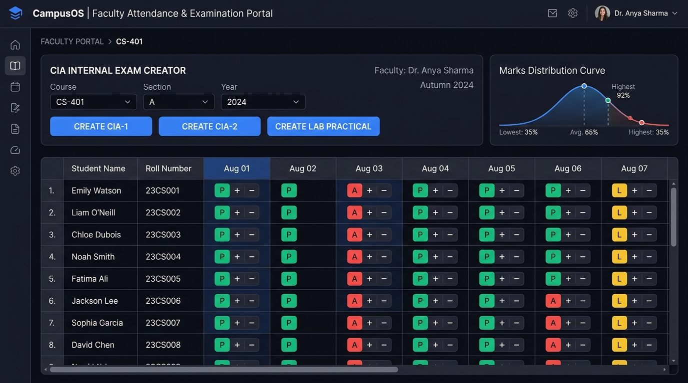
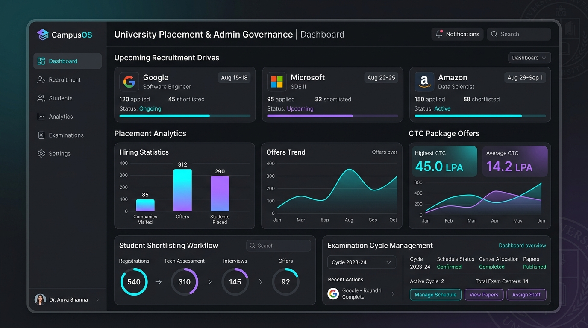
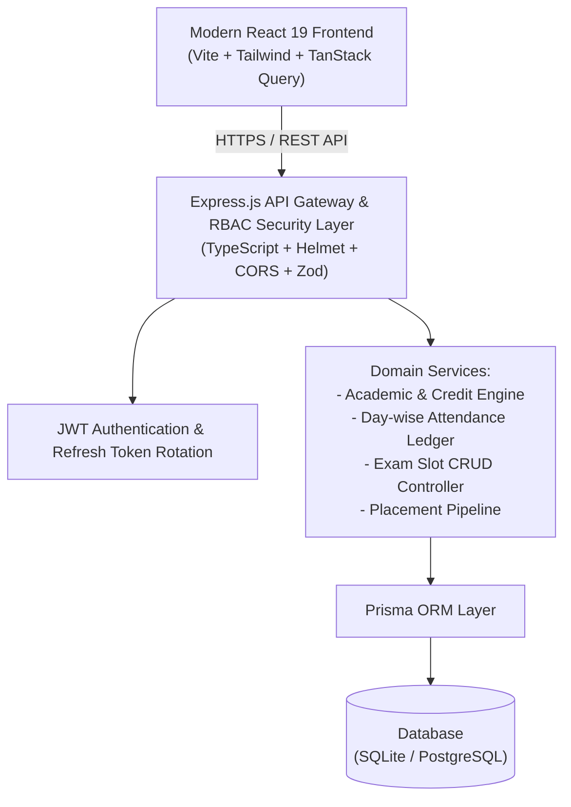

<div align="center">

# 🎓 CampusOS — Next-Gen Smart Campus Operating System

**One Campus. One Platform. Complete Academic Intelligence.**

[](https://campusos-cjfi.onrender.com)
[](https://campusos-cjfi.onrender.com)
[](https://campusos-cjfi.onrender.com)
[](https://campusos-cjfi.onrender.com)
[](https://campusos-cjfi.onrender.com)
[](LICENSE)

### 🌐 [**Access Live Application Here**](https://campusos-cjfi.onrender.com)

<br/>



</div>

---

## 📌 Overview

**CampusOS** is an enterprise-grade university operating system designed to unify academic workflows, student course registrations, daily attendance tracking, continuous internal evaluations (CIA), semester examination schedules, and end-to-end campus placements into a single, high-performance platform.

Built with **React 19, TypeScript, Express.js, and Prisma ORM**, CampusOS eliminates fragmented spreadsheets and disjointed tools with role-specific dashboards tailored for **Students, Faculty, Department Heads (HODs), Placement Officers, and University Administrators**.

---

## 🚀 Live Demo & One-Click Login

Access the live cloud deployment on Render:
👉 **[https://campusos-cjfi.onrender.com](https://campusos-cjfi.onrender.com)**

> 💡 **Quick Evaluation**: The top navigation bar includes an interactive **1-Click Role Switcher** dropdown to test any persona instantly without entering passwords.

### 🔑 Demo Accounts

| Role | Email | Password | Key Capabilities & Modules |
| :--- | :--- | :--- | :--- |
| **Student** | `john.doe@campusos.edu` | `Student@123` | Degree credit progress (80/160), Pre-registration priority list, Backlog Add/Drop, Timetable |
| **Student (Dean's List)** | `ananya.sen@campusos.edu` | `Student@123` | 9.15 CGPA, Placement eligibility check, Hall ticket download, Disciplines exploration |
| **Faculty (Prof. Sharma)** | `prof.sharma@campusos.edu` | `Faculty@123` | Excel-style daily attendance matrix (P/A/L toggling), CIA exam creation, Grade entry |
| **Department Head (HOD)** | `hod.cse@campusos.edu` | `Faculty@123` | Curriculum management, Course approvals, Department GPA analytics, Faculty load audit |
| **Placement Officer** | `placement@campusos.edu` | `Placement@123` | Drive creation, Real-time CTC analytics, Student shortlisting, Placement offers |
| **University Admin** | `admin@campusos.edu` | `Admin@123` | Add/Remove university exam slots, Venue allocation, User RBAC, Global system audit logs |

---

## 🌟 Key Modules & Visual Tour

### 1. 🎓 Student Academic & Course Registration Suite


- **Degree Audit & Credit Tracker**: Real-time visualization of earned degree credits (e.g. 80 / 160 credits completed), current semester standing, and cumulative GPA metrics.
- **Drag-and-Drop Pre-Registration**: Interactive priority ranking for upcoming semester electives and specialized tracks.
- **Backlog Add/Drop Manager**: Direct interface for adding backlog courses or dropping elective clashes with automated prerequisite checks.
- **Weekly Schedule & Timetable**: Dynamic timetable matrix detailing course codes, lecture halls, instructors, and time slots.
- **Discipline Specializations**: Track progress across specialized academic pathways such as AI/ML, Cloud Computing, Cyber Security, and Systems Engineering.

---

### 2. 👨‍🏫 Faculty Attendance Ledger & Internal Exam Engine


- **Excel-Style Day-by-Day Attendance Matrix**: Full spreadsheet-like attendance matrix displaying all enrolled students across dates with instant `P` (Present), `A` (Absent), and `L` (Late) status toggles.
- **One-Click CSV/Excel Data Export**: Download class attendance ledgers for institutional record-keeping.
- **CIA Internal Exam Creator**: Dynamically create internal exams (CIA-1, CIA-2, Lab Practicals, Quizzes, Surprise Tests) with custom max marks, dates, and weightages.
- **Grade Distribution & Analytics**: Automatic calculation of averages, highest marks, and standard bell curves.

---

### 3. 🏛️ Admin Governance & Placement Recruitment Hub


- **Dynamic University Exam Schedule Management**: Full control to increase, decrease, or reschedule semester examination slots, dates, and venues across academic departments.
- **End-to-End Placement Pipeline**: Track tier-1 recruitment drives (Google, Microsoft, Amazon), filter eligible applicants by minimum CGPA and backlog thresholds, and update shortlisting rounds.
- **CTC & Compensation Analytics**: Comprehensive dashboards showing placement percentages, package distributions (Highest CTC: 45 LPA, Average CTC: 14.2 LPA), and historical hiring trends.
- **RBAC & Security Audit Logs**: Tamper-evident logging of administrative actions, grade changes, and registration approvals.

---

## 🏗️ Technical Architecture



### 💻 Tech Stack Highlights

- **Frontend**: React 19, TypeScript, Vite, Tailwind CSS, Lucide React, Recharts, TanStack Query, React Hook Form, Zod.
- **Backend**: Node.js, Express.js, TypeScript, Prisma ORM, JSON Web Tokens (JWT), Bcrypt, Zod.
- **Database**: SQLite (Local Dev / Embedded) & PostgreSQL (Production).
- **Deployment & Containers**: Multi-stage Docker build, Render Web Service, Nginx/Node production serving.

---

## 🛠️ Local Development Setup

### Prerequisites
- Node.js 18+ or 20+
- npm 9+ or yarn

### 1. Clone the Repository
```bash
git clone https://github.com/Himarghya/CampusOS.git
cd CampusOS
```

### 2. Backend Setup
```bash
cd backend
npm install
npx prisma db push
npx tsx prisma/seed.ts
npm run dev
```
> Backend API will be available at `http://localhost:5000`

### 3. Frontend Setup
```bash
cd ../frontend
npm install
npm run dev
```
> Frontend application will be available at `http://localhost:5173`

---

## 🐳 Docker Setup

Run the full platform locally using Docker:

```bash
# Build and run the single-container production image
docker build -t campusos .
docker run -p 5000:5000 -e PORT=5000 campusos
```

Or using Docker Compose:

```bash
docker compose up --build
```
Access the application at `http://localhost:5000`.

---

## 🧪 Testing & Verification

Run the comprehensive integration test suite:

```bash
# Run backend tests with Vitest & Supertest
cd backend
npm test

# Run frontend linting and type-checks
cd ../frontend
npm run build
```

---

## 📄 License

This project is licensed under the MIT License — see the [LICENSE](LICENSE) file for details.

---

<div align="center">
  <b>Built for higher-education excellence with ❤️ by the CampusOS Team</b><br/>
  <sub>Deployment: <a href="https://campusos-cjfi.onrender.com">https://campusos-cjfi.onrender.com</a></sub>
</div>
